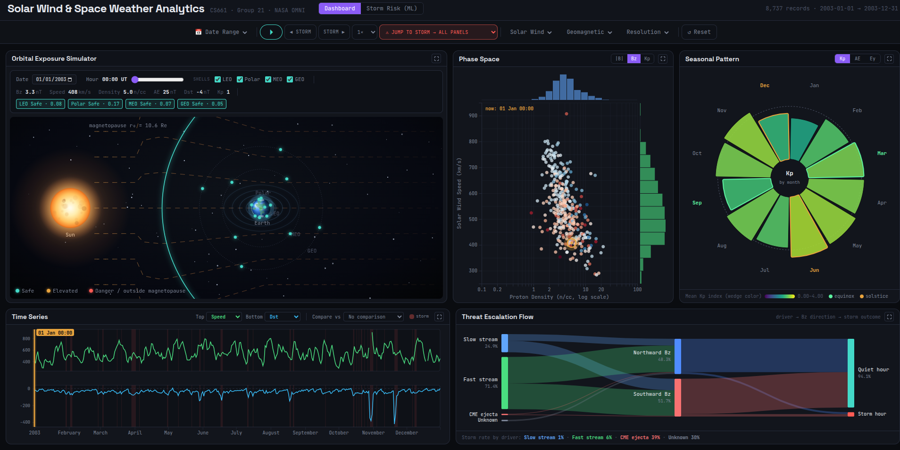
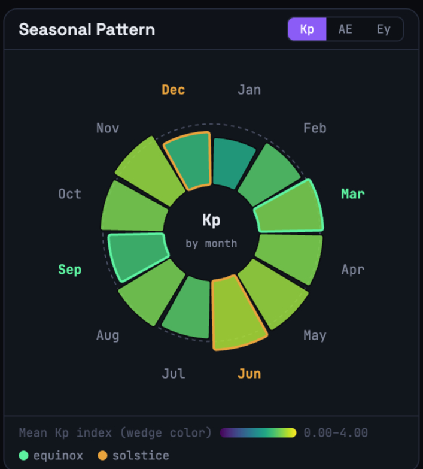
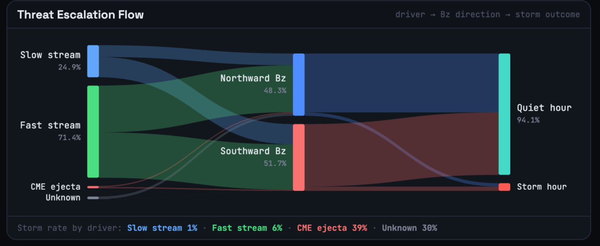
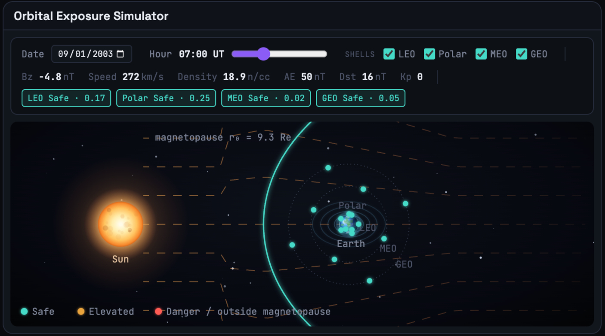
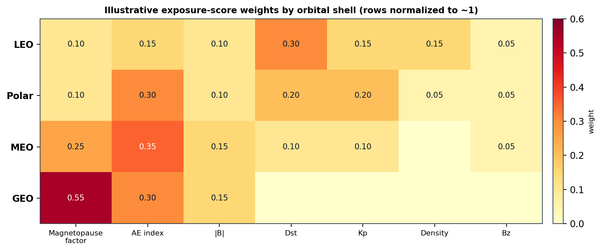
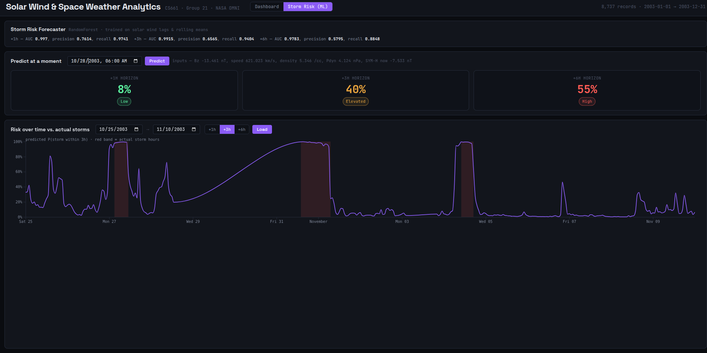
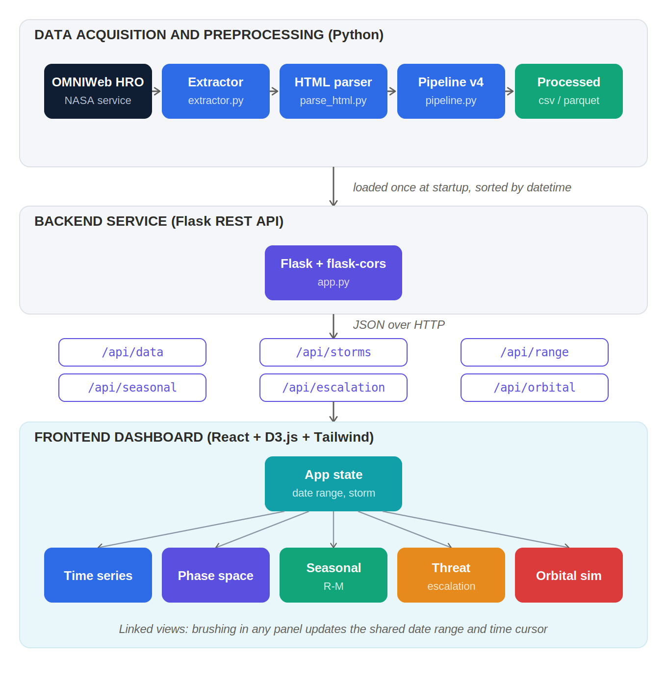
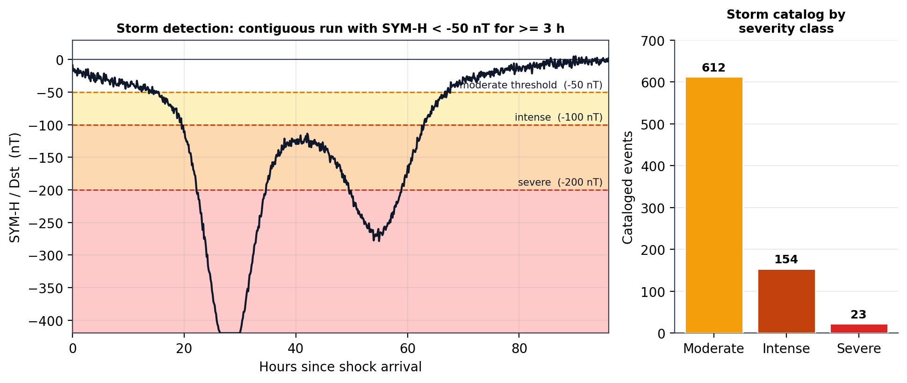

# Solar Wind & Space Weather Analytics

**An interactive dashboard — plus a machine learning forecaster — built on 30 years of
real NASA satellite data, that explains when the Sun threatens satellites and power
grids on Earth, and predicts when the next disruption is coming.**

CS661 Big Data Visual Analytics · IIT Kanpur · Group 21

---

## The problem, in plain terms

The Sun constantly throws out a stream of charged particles called the **solar wind**.
Most of the time Earth's magnetic field shrugs it off. But every so often, the stream
carries a magnetic field pointed the wrong way, and it slams into Earth's magnetic field
hard enough to cause a **geomagnetic storm** — the kind of event that can knock out GPS,
disrupt radio communication, damage satellites, and in extreme cases, black out power
grids.

NASA has been measuring this continuously since 1995, hour by hour, for three decades.
That's a genuinely huge, valuable dataset. But it's locked away in fixed-width text files
wrapped in raw HTML, spread across 47 unlabeled columns, riddled with inconsistent
placeholder values for missing data, and effectively unreadable unless you already know
the underlying physics. **Nobody was actually using this data because nobody had made it
usable.**

This project turns that raw NASA archive into something anyone can explore in a browser
— and then goes one step further, training a machine learning model that watches the
current solar wind and estimates how likely a storm is in the next 1, 3, or 6 hours.

## What we actually built

Two things, that work together:

1. **An interactive dashboard** — five linked, real-time charts that let you scrub through
   30 years of space weather, jump straight to a famous historic storm, and watch exactly
   how it would have affected a satellite in orbit.
2. **A storm risk forecaster** — a trained model that looks at what the solar wind is
   doing right now and predicts the odds of a storm hitting in the next few hours, with
   measured accuracy you can check yourself against real historic storms.

Both are one full-stack web application: a Python pipeline that builds the dataset, a
Flask API that serves it, and a React + D3.js frontend that visualizes it.

---

## The dashboard



All five views are visible at once, driven by one shared toolbar — pick a date range or
jump straight to a cataloged storm (like the famous October 2003 "Halloween storms"), and
every panel updates together.

### Time Series — "when did this happen?"
Two stacked charts tracking any of nine solar wind / geomagnetic parameters over time,
with storm periods shaded directly on the chart so a spike in any measurement can be
immediately tied to an actual storm. You can also overlay a second historic storm on top
of the current one, time-aligned, to compare how two unrelated events actually unfolded.

### Phase Space Explorer — "what kind of solar wind is this?"
Not every gust of solar wind is the same — fast wind and slow wind behave differently and
carry different storm risk. This panel plots speed against density as a scatter so
different types of solar wind visibly separate into different clusters, and you can lasso
a cluster to jump straight to when those conditions occurred in time.

### Seasonal Pattern — "does the time of year matter?"



Storms are, on average, more common around the equinoxes (March/September) than the
solstices (June/December) — a real, well-documented physical effect. This radial chart
makes that pattern immediately visible at a glance, month by month, for whatever date
range is currently loaded — so you can check whether the pattern holds in a particular
year, not just on average across 30 years.

### Threat Escalation Flow — "why do storms actually happen?"



A storm isn't random — it's the outcome of a specific chain of conditions. This flow
diagram traces that chain: what kind of solar wind stream came in, which way its magnetic
field was pointing, and whether that combination actually triggered a storm. It makes a
subtle but important physical fact directly visible: a southward-pointing magnetic field
is *necessary* for a storm, but on its own it's *not enough* — most southward-Bz hours are
still quiet.

### Orbital Exposure Simulator — "so what does this mean for a satellite?"



This is the panel that turns physics into something a satellite operator actually cares
about. It animates Earth's magnetic shield (the *magnetopause*) compressing inward as
storm conditions worsen — using a real published physics model (Shue et al., 1998), not
a stylized cartoon — and scores the real-time risk to four common satellite orbit classes
(Low Earth Orbit, Polar, Medium Earth Orbit, and Geostationary) as the boundary moves.
During a severe storm, the shield can compress inward past where geostationary satellites
sit, leaving them directly exposed. Each shell's risk score is a transparent, published
weighting:



*(Read as: for a GEO satellite, the score weights how compressed the magnetopause is most
heavily; for a LEO satellite, the Dst geomagnetic index matters more — different orbits
are stressed by different mechanisms, and the scoring reflects that.)*

---

## The storm risk forecaster (machine learning)



Everything above is about understanding storms that *already happened*. This part looks
forward: **given what the solar wind is doing right now, how likely is a storm in the
next 1, 3, or 6 hours?**

### How it works, without the jargon

Think of it like a weather forecast, but for space weather. The model looks at the
current strength and direction of the solar wind's magnetic field, how fast and dense the
wind is, and how those numbers have been trending over the last few hours — then outputs
a probability, like "40% chance of a storm within 3 hours."

Under the hood, this is a **Random Forest classifier** — a well-established, explainable
machine learning method — trained separately for each of the three time horizons (1
hour, 3 hours, 6 hours ahead), using 20 engineered inputs built from the same NASA dataset
the dashboard already uses: the current readings, how they've changed over the last 1–3
hours, and how persistent certain warning signs (like a sustained southward magnetic
field) have been.

We deliberately picked a simple, explainable model over something like a neural network:
solar wind conditions tend to persist hour to hour, so a handful of recent readings
already carry most of the useful signal, and a Random Forest handles the fact that storms
are rare events (only ~3% of hours) without needing exotic tuning.

### Does it actually work?

We tested it the honest way: trained only on the oldest 85% of the timeline, and tested
on the most recent 15% it had never seen — not a random shuffle, which would let the
model "peek" at storms it was also being graded on.

| Forecast horizon | How often it correctly flags a real storm (Recall) | How often a flagged storm turns out real (Precision) | Overall separation (AUC) |
|---|---|---|---|
| **1 hour ahead** | 97.4% | 76.1% | 0.997 |
| **3 hours ahead** | 94.0% | 65.7% | 0.992 |
| **6 hours ahead** | 88.5% | 58.0% | 0.978 |

**In plain terms:** the model almost never misses an actual storm — that's the number
that matters most for an early-warning tool, since a missed storm is far more costly than
a false alarm. It gets somewhat more cautious (more false alarms) the further out it
predicts, which is exactly what you'd expect — 6 hours is a harder call than 1 hour — but
even at 6 hours it still catches nearly 9 out of every 10 real storms.

You can check this yourself in the app: load the model's risk curve for the October 2003
Halloween storms — one of the most famous space weather events on record — and watch
predicted risk climb before the actual storm hits (shaded in red).

### Being upfront about its limits
This is a decision-support signal, not a certified operational forecasting system — it's
validated on one historical split, not across multiple full solar cycles, and a real
deployment would need broader validation. We think that's a more useful thing to say
than pretending it's bulletproof.

---

## How it's built (architecture)



Three clean layers, each doing one job:

1. **Data pipeline (Python)** — downloads NASA's raw OMNI archive year by year, strips it
   out of the HTML wrapper it's delivered in, parses the verified 47-column layout,
   removes the many different placeholder values NASA uses for missing data, computes
   derived physics quantities (like solar wind pressure), and builds a transparent,
   rule-based catalog of every storm in the record (789 storms cataloged: 612 moderate,
   154 intense, 23 severe).

   

2. **Backend (Flask REST API)** — loads the cleaned data once into memory and serves fast
   slices of it on demand, plus the trained ML model's predictions, over a small set of
   JSON endpoints. No raw data or heavy computation ever touches the browser.
3. **Frontend (React + D3.js)** — five custom-built visualizations (including a hand-built
   SVG Sankey diagram and a Canvas-based physics animation) sharing one global state, so
   a selection made in any single panel — a date range, a lasso, a time cursor — instantly
   updates every other panel.

---

## Running it yourself

**Requirements:** Node.js ≥ 18, Python ≥ 3.10

### 1. Clone and install

```bash
git clone <this-repo-url>
cd BigData-Project
npm install
cd server && pip install -r requirements.txt && cd ..
```

We'd recommend using a Python virtual environment rather than installing into your
system Python:

```bash
cd server
python3 -m venv .venv
source .venv/bin/activate        # on Windows: .venv\Scripts\activate
pip install -r requirements.txt
cd ..
```

### 2. Train the storm risk model (one-time step)

**The trained model is not included in this repository** — it's a multi-megabyte binary
artifact that's fully reproducible from the dataset, so we don't commit it. You need to
train it once yourself before the ML tab will work:

```bash
cd server
python train_storm_model.py
```

This trains all three horizon models (1h / 3h / 6h) and writes them to
`server/models/storm_models.joblib`, along with `server/models/metrics.json`. It takes a
few minutes on a normal laptop CPU. Until this step is run, every other part of the
dashboard works fine — only the "Storm Risk (ML)" tab will show a "model not trained yet"
message.

### 3. Run the app (two terminals)

```bash
# Terminal 1 — Flask API (port 5000)
cd server
source .venv/bin/activate   # if you created one above
python app.py

# Terminal 2 — Vite dev server (port 5173)
npm run dev
```

Then open **http://localhost:5173**. Vite proxies API requests to the Flask server, so
both need to be running.

---

## Project structure

```
BigData-Project/
├── DataPreprocessing/        Standalone scripts that build the dataset from raw NASA data
│   ├── dataset_extractor.py    downloads raw OMNI HRO files, year by year
│   ├── parse_html.py           strips the HTML wrapper, keeps numeric rows
│   └── pipeline.py             cleans, derives features, builds the storm catalog
├── server/
│   ├── app.py                  Flask API — all endpoints, including the ML ones
│   ├── storm_features.py       feature engineering shared by training and serving
│   ├── train_storm_model.py    trains and saves the storm risk forecaster
│   ├── omni_processed.csv      the cleaned, analysis-ready dataset
│   └── models/                 (created after you train — not committed)
├── src/
│   ├── App.jsx                  top-level layout and shared dashboard state
│   ├── components/               one file per panel (Time Series, Phase Space,
│   │                              Seasonal Pattern, Threat Escalation, Orbital Simulator,
│   │                              MLPrediction, MenuBar)
│   ├── hooks/                    shared data-fetching hooks
│   └── utils/                    filtering helpers, the Shue magnetopause model
├── docs/                       README images (dashboard-screenshots + report figures)
└── CS661_ProjectReport_Group21.pdf   full academic report (architecture, physics
                                        background, and the ML methodology in detail)
```

## API endpoints

| Endpoint | What it returns |
|---|---|
| `GET /api/data?start=&end=` | Hourly solar wind / geomagnetic records for a date range |
| `GET /api/storms`, `/api/orbital/storms` | Cataloged storm events with severity and peak stats |
| `GET /api/seasonal?start=&end=` | Mean Kp / AE / electric field by calendar month |
| `GET /api/escalation_flow?start=&end=` | Hourly counts by driver type → Bz direction → outcome |
| `GET /api/range` | Full available date range in the dataset |
| `GET /api/model/info` | ML model metadata and accuracy metrics |
| `GET /api/predict?datetime=` | Storm probability at 1h/3h/6h for a chosen moment |
| `GET /api/predict/range?start=&end=&horizon=` | Risk curve across a date range, for validating the model against real storms |

## Tech stack

- **Frontend:** React 19, D3.js v7, Tailwind CSS v4, Vite
- **Backend:** Flask, Flask-CORS, pandas
- **Machine learning:** scikit-learn (Random Forest), joblib
- **Data:** NASA OMNIWeb High Resolution dataset, 1995 onward

## Full technical report

The complete academic report — theoretical background on solar wind physics, the full
data cleaning methodology, detailed panel-by-panel design rationale, and the full machine
learning methodology and results (Appendix A) — is included as
[`CS661_ProjectReport_Group21.pdf`](CS661_ProjectReport_Group21.pdf).
